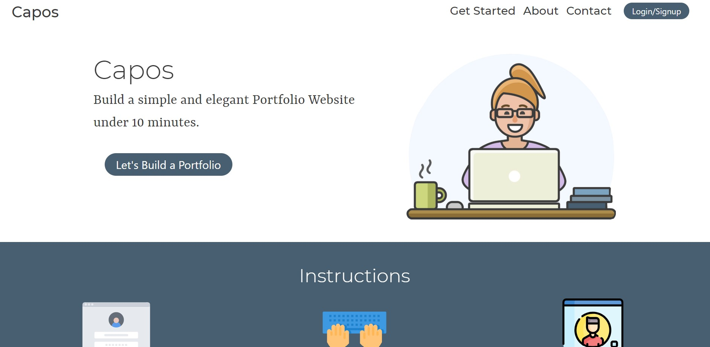
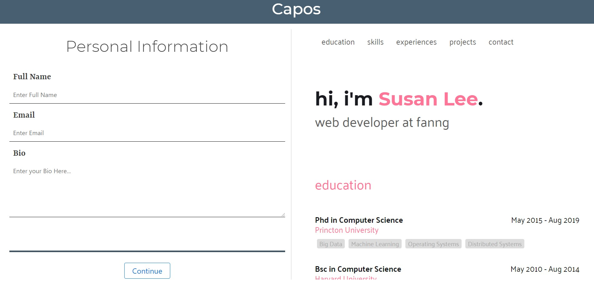

<h1 align="center">
Portfolio Designer
</h1>

	

                                                              

Web App for creating fast and stylish portfolios..

## Demo
You can see the live site [here](https://capos.netlify.app/)

## Motivation

Due to the COVID19 pandemic, millions of people have lost thier jobs and livelyhood. To combat this and help people get their jobs again, we created this web app that allows users to create stylish and job specific portfolios.

A great portfolio can attract the eyes of many recruiters. It can get you an interview and also allow you to show off your skills and project. But for people whose work involves mostly non-design technical jobs, it is hard to create an appealing portfolio website.

Our web app to solve this very issue. Our web app will allow users to enter their information and we will create them a stylish looking portfolio based on templates that the users picks and give them a shareable link. They will even have the options to choose from different designs and layouts. Furthermore, we also provide a system where they will be delivered the source code, allowing them to host the site on their own.

Our web app will allow for specific tailored portfolio for each job and occupation.

## How it works

You can go to the live site and follow the instructions there.

## Project Status: Work in Progress
